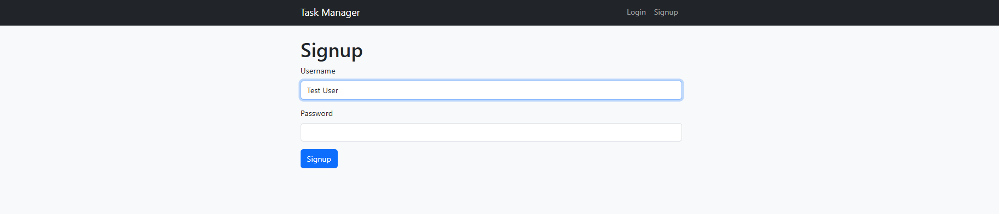

# Task Manager Web Application

## Overview
This is a fully functional **Task Management Web Application** that combines a robust backend with a polished frontend for a seamless user experience. The application is designed to help users manage their tasks efficiently, with features like user authentication, task creation, and task tracking. 

### Key Features
- **User Authentication:** Signup and login functionality to ensure secure access.
- **Task Management:** Create, read, update, and delete tasks with ease.
- **Interactive Frontend:** Enhanced user experience with JavaScript interactivity.
- **Responsive Design:** Styled with CSS to ensure a clean and professional look on all devices.
- **Backend Support:** Built using Python and Flask for seamless data management.

## Technologies Used
### Backend
- **Python**: Core programming language.
- **Flask**: Web framework for building the application.
- **SQLite**: Lightweight database for data persistence.

### Frontend
- **HTML**: Structure of the web pages.
- **CSS**: Styling for the application.
- **JavaScript**: Dynamic interactions and interactivity.

## Features and Screenshots

### 1. **Signup and Login**
Users can create an account and log in to access their personalized dashboard.

### 2. **Task Dashboard**
Tasks are displayed in an organized layout, with options to add, edit, or delete tasks.

### 3. **Screenshots**
Below is a sample screenshot of the application:



---

## Installation and Setup

1. Clone the repository:
   ```bash
   git clone https://github.com/Swyampatel/Task-Manager-Web-Application
   cd TASK-MANAGER
   ```

2. Create and activate a virtual environment:
   ```bash
   python -m venv venv
   source venv/bin/activate  # For Linux/Mac
   venv\Scripts\activate    # For Windows
   ```

3. Install dependencies:
   ```bash
   pip install -r requirements.txt
   ```

4. Run the application:
   ```bash
   python app.py
   ```

5. Open your browser and navigate to:
   ```
   http://127.0.0.1:5000
   ```

---

## What I Learned

### 1. **Backend Development:**
- Implementing RESTful APIs with Flask.
- Using SQLite for persistent data storage.

### 2. **Frontend Development:**
- Crafting responsive layouts with HTML and CSS.
- Enhancing interactivity using JavaScript.

### 3. **Full-Stack Development:**
- Integrating the frontend with the backend to create a cohesive user experience.

### 4. **Version Control:**
- Managing code with Git and maintaining clean repository structures.

## Future Improvements
- Add user-specific task categories.
- Implement task reminders using email notifications.
- Improve UI/UX with advanced styling frameworks.
- Deploy the application to a cloud platform for wider accessibility.

---

